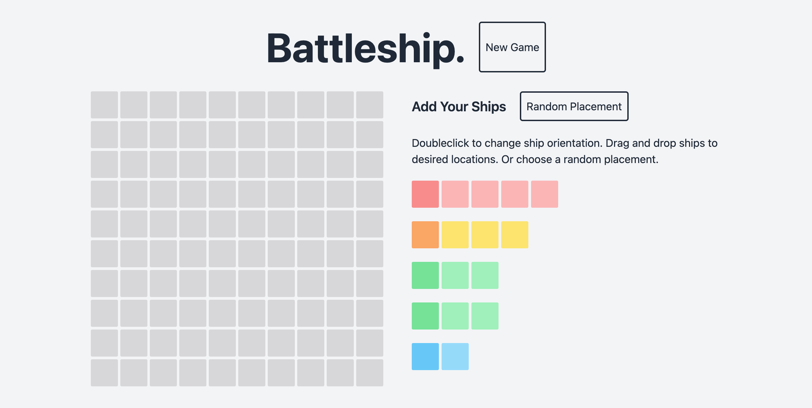
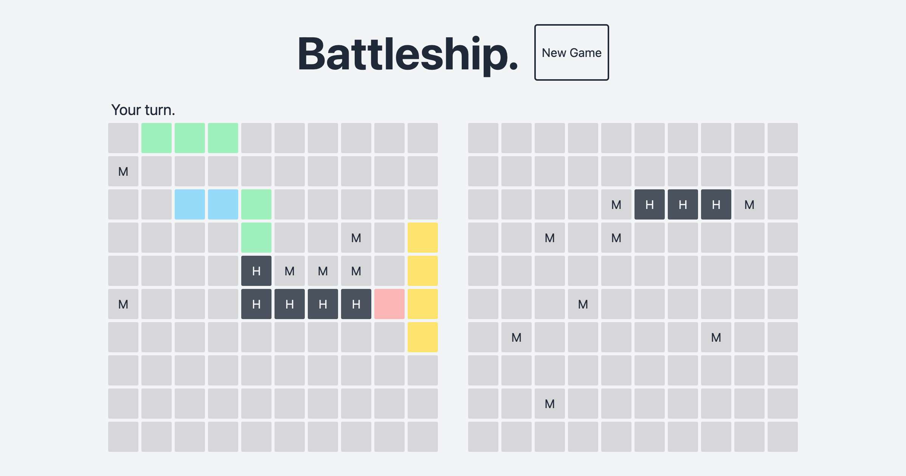

# Battleship

An implementation of Battleship for the [Odin Project](https://www.theodinproject.com/).

## Features

- Drag and drop ship placement.
- Computer opponent.
- Option to randomly place ships.

### Built with

- Webpack
- Tailwind
- Eslint
- Prettier
- Jest

### Screenshots

Setup:

Midgame:

